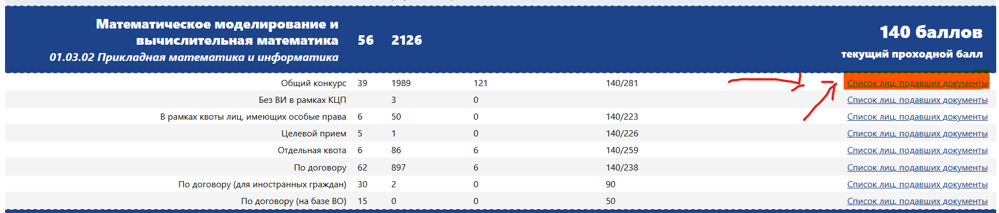
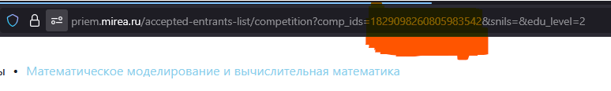

# Парсер списков МИРЭА

Программа для парсинга в эксель списков поступающих из мирэа
Изначальная идея была заскейлить для всех вузов, но из за разности методов и подходов парсинга к каждому из них я решил остановиться именно на МИРЭА
# Быстрый старт 

1. Скопировать этот репозиторий себе на комп

2. Воспользоватся уже собранной версией программы/ или собрать самому (go build main.go, целостность можно сверив хэш сумму)

```sha256
Хэш SHA256 main.exe:
75b25cb46620fcc737bd60ec7f4b9625ab07ec37258149659a678b0e48dd548e
```

3. Сконфигурируй программу под себя - собери все айдишники интересующих тебя направлений в config.txt - один код, одна строка 

4. Коды направлений стоит брать из url списков, как показано на картинках ниже

[ССЫЛОЧКА НА СПИСКИ](https://priem.mirea.ru/accepted-entrants-list/?edu_level=2)


Работу на списках кроме общего конкурса не проверял, но та же идея парсинга должна быть справедлива и для них


##### айдишник помечен красным

5. После этого запускаем файл и получаем эксель файл с списками в формате excel

# Помогло - поставь звезду!